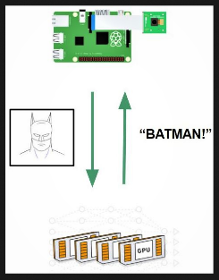

## Face Recognition with CNN and Raspberry Pi

[Go back to the Main Page](index.md)

Last year, my roommate, who was an electrical engineer, became interested in smart home systems and started making small IoT devices. During a conversation of ours, we decided it would be really cool to set up a face recognition system at our front door. How can I teach a Raspberry Pi to recognize me? There wasn't any available tutorials online (everthing I found was using Eigenface - so outdated!), so I thought why not using the powerful Convolutional Neural Networks? Then came this project.

On this page, I will go over the important theory and skills involved and walk you through about to build a face recognition module. My code can be found in this repository.

After I finished this project, it was integrated by a ECE hands-on project course at UC San Diego. I was excited that young students could have the opportunity to learn some hands-on skills in deep learning and computer vision.


### Project Steps

- Step 1: Understand the Problem
- Step 2: Face Detection with OpenCV
- Step 3: What's a Convolutional Neural Network?
- Step 4: Data Collection
- Step 5: Train a CNN
- Step 6: Connect to Raspberry Pi


### Step 1: Understand the Problem

This problem can be divided into two smaller problems - **face detection** and **face recognition**. First we need to know if a given image contains a face and where the face is located, and then we can recognize who the person is. You may also combine them into one problem but you will need a more complex model. For now, we will start with a more straight-forward method.

Face detection is actually a **regression problem** -- you need to know where a face is in an image with coordinates. The face detection function provided by OpenCV is accurate for frontal faces, which is what we are interested in, so we will just use that. Face recognition is a standard **classification problem** - you need to guess which class, in this case person, a face image belongs to. Recognition is the part where we will need to create a dataset and train our own CNN model.

To set up the system to incorporate a **Raspberry Pi**, I plan to use the Pi as a local data collector to detect faces and send a face image to a remote server and the remote server will predict who the person is and returns the result to display on the Pi. I will use a Pi Camera to take images as it is more compatible with an RPi than USB webcams. If this system works well, we can then easily intergrate it in a smart home system.




### Step 2: Face Detection with OpenCV

**OpenCV** is a nice libray that allows you to perform a lot of basic operations for image processing and computer vision. It has a nice face detection function. On a higher level OpenCV provides a **Harr Cascade Classifier**, which with **pre-trained information of faces** we can use to detect faces. The Harr Cascade classifier uses different levels of **feature extractors** across an entire image to locate regions of interest (faces, in this case). As the classifier goes to a higher level, the feature extractors become more complex, contain more information and are more accurate in locating regions on interest. For example, feature extractors may start with edges, and then curves, and then more detailed features that resemble specific face features such as hair and eyes. 

The diagrams below is a good example of how the classifier works. They are borrowed from the [OpenCV documentation](https://docs.opencv.org/3.3.0/d7/d8b/tutorial_py_face_detection.html), which also has a detailed explanation on the classifier.


I tried the function on a few images of myself and found the results satisfying. One thing to note is that OpenCV only supports **frontal face detection**. Faces that are tilted or side-ways to a small degree are also allowed. This limitation is ok for our purpose, although a little restricting - we just need to recognize frontal faces. 

Now I need to apply it on a real-time video stream, because the device should be able to automatically detect faces coming into the view, otherwise it would be some trouble for users to manually take an image. 

After some research on RPi and Pi Camera, here's how I detect faces on a read-time video stream. For simplicity, I used pseudo code for some parts. Again the detailed code is linked at the begining of this article.

```
# initialize face detector
cascade_path = 'haarcascade_frontalface_default.xml'  # this is the actual path on your local machine
face_cascade = cv2.CascadeClassifier(cascade_path)

# initialize camera, frame size, etc

# run video stream
for frame in camera.capture_continuous():
    
    # detect faces in frame
    faces = face_cascade.detectMultiScale(frame)

    # draw bounding rectangles on detected faces
    for coordinates in faces:
        cv2.rectangle()
    
    # display the processed frame
    cv2.imshow('Output', frame)
```

Now we've solved the first part of the problem!


### Step 3: What's a Convolutional Neural Network?

In order to achieve high accuracy on face recognition, I decided to use **Convolutional Neural Networks (CNNs)**. CNNs are extremely powerful tools in computer vision to solve problems including image classification and segmentation. If given a large dataset with high variability, CNNs are able to learn complex features very well. For this project, we are using a CNN to classify faces.

How does a CNN work? To give you some intuitive ideas:
- A CNN has convolutional and fully connected layers. 
- **Convolutional layers** learn 2D visual features from the training images. As we go deeper into the network, the features become more complex. For example, we want the CNN to learn important features of faces, such as different eyes, hair, nose, mouth, shapes of faces, and so on. The CNN can assign those features **weights** and different combinations of weights with features correspond to different faces. Here's a good example of features learned by a CNN:


- During **training**, the network will **adjust the weights** to achieve the best classification result. CNNs adopt **Gradient Descent** method to find the best values of weights. We can think of the classification problem as a loss function (difference between predictions and ground truth) with respect to w (weights). Our goal for training is to find the w that minimizes the loss function. Most of the time, we don't have closed form solutions for w. Hence, we have to use Gradient Descent to get to the minimum point step by step. Gradient Descent is an iterative procedure to adjust values based on current gradient. 


- A trained model contains the best feature representation of classes, and it should work well on new images


### Picture Credits
https://docs.opencv.org
https://image.slidesharecdn.com/case-study-of-cnn-160501201532/95/case-study-of-convolutional-neural-network-3-638.jpg?cb=1462133741


### References (Thank you!)
https://docs.opencv.org/3.3.0/d7/d8b/tutorial_py_face_detection.html


